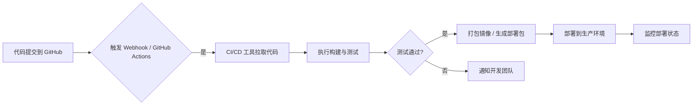

# HRassistant

招聘助手包含浏览器插件、Web 管理后台、历史数据存储、钉钉机器人问答与生产部署流水线。

## 核心能力

- 浏览器插件自动识别候选人页面，按页面状态执行索要简历、接收简历、保存候选人信息。
- Web 管理后台保存所有历史候选人、推荐报告和钉钉配置。
- 钉钉机器人支持昨日招聘汇总推送和基于历史数据的问答 Agent。
- GitHub Actions 提供提交触发、构建测试、镜像打包、生产部署、失败通知和健康监控。

## 部署流程

完整 CI/CD 说明见：

```text
docs/CICD_DEPLOYMENT.md
```

流水线对应流程：



## 本地启动 Web 后台

```bash
cd 招聘助手/recruitment_bot/web_admin
python3 server.py
```

打开：

```text
http://127.0.0.1:8787
```
