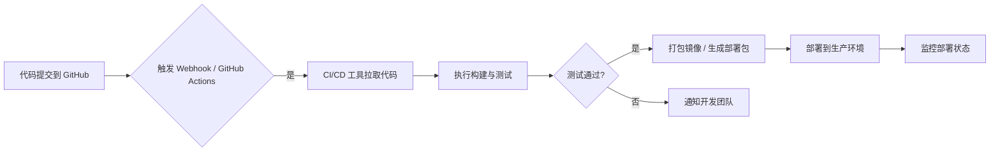

# 招聘助手 CI/CD 与生产部署流程

## 流程总览



## 已提供能力

- 提交到 `main` 自动触发 `.github/workflows/ci-cd.yml`。
- CI 阶段校验 Python 后端语法、浏览器插件 JavaScript 语法。
- 自动打包浏览器插件 zip，作为 GitHub Actions artifact 保存。
- 自动构建 Web 管理后台 Docker 镜像，并推送到 GitHub Container Registry。
- 配置生产环境密钥后，通过 SSH 自动部署到服务器。
- 部署后调用 `/api/health` 进行健康检查。
- 构建或部署失败时，可通过钉钉机器人通知开发团队。
- `scripts/notify-dingtalk.sh` 支持钉钉机器人加签通知。

## GitHub Secrets

在 GitHub 仓库中进入 `Settings -> Secrets and variables -> Actions`，添加：

| 名称 | 必填 | 说明 |
| --- | --- | --- |
| `PROD_HOST` | 部署必填 | 生产服务器 IP 或域名 |
| `PROD_USER` | 部署必填 | SSH 登录用户 |
| `PROD_SSH_KEY` | 部署必填 | 可登录服务器的私钥内容 |
| `PROD_PORT` | 可选 | SSH 端口，默认 `22` |
| `RECRUITMENT_DOMAIN` | 可选 | 生产域名，便于通知和文档引用 |
| `DINGTALK_WEBHOOK` | 可选 | 钉钉机器人 webhook，用于失败通知 |
| `DINGTALK_SECRET` | 可选 | 钉钉机器人加签 secret |

没有配置生产 SSH secrets 时，流水线会完成构建和镜像推送，并跳过生产部署。

## 服务器准备

生产服务器需要安装：

- Docker
- Docker Compose v2
- Git
- curl

首次部署时，流水线会使用以下目录：

```text
/opt/hrassistant
```

服务默认监听：

```text
http://127.0.0.1:8787
```

建议使用 Nginx、Caddy 或宝塔将公网 HTTPS 域名反向代理到 `127.0.0.1:8787`。

## 手动部署

在服务器上执行：

```bash
git clone https://github.com/m15701162024-afk/HRassistant.git /opt/hrassistant
cd /opt/hrassistant
chmod +x scripts/deploy-production.sh
IMAGE_TAG=latest ./scripts/deploy-production.sh
```

## 监控部署状态

健康检查接口：

```text
/api/health
```

本机检查：

```bash
scripts/check-production.sh http://127.0.0.1:8787
```

Docker 容器状态：

```bash
docker compose -f 招聘助手/recruitment_bot/web_admin/docker-compose.prod.yml ps
docker compose -f 招聘助手/recruitment_bot/web_admin/docker-compose.prod.yml logs -f recruitment-web-admin
```

## 浏览器插件发布包

每次流水线会生成：

```text
browser-extension-<commit>.zip
```

可在 GitHub Actions 对应运行记录的 `Artifacts` 中下载，用于浏览器扩展安装或分发。

## 内网插件分发与安全白名单

Web 管理后台提供动态插件包：

```text
GET /api/extension/package
```

内网用户访问 `http://10.100.60.5:8787/` 后，可在 `系统配置 -> 内网插件安装包` 下载已配置 zip。该 zip 会预置后端地址，并在 `manifest.json` 中只加入当前后端主机的访问权限。

服务端白名单配置位于：

```text
招聘助手/recruitment_bot/web_admin/security_allowlist.json
```

默认允许：

- Host：`10.100.60.5`、`127.0.0.1`、`localhost`
- Origin：`http://10.100.60.5:8787`、本机调试地址
- Chrome 扩展来源：`chrome-extension://...`

可通过环境变量覆盖：

| 变量 | 说明 |
| --- | --- |
| `RECRUITMENT_ALLOWED_HOSTS` | 逗号分隔 Host 白名单 |
| `RECRUITMENT_ALLOWED_ORIGINS` | 逗号分隔 Origin 白名单 |
| `RECRUITMENT_ALLOWED_CLIENT_IPS` | 逗号分隔 IP/CIDR 白名单，留空表示不限制客户端 IP |
| `RECRUITMENT_IP_ALLOWLIST` | 兼容本地部署脚本的 IP/CIDR 白名单变量 |
| `RECRUITMENT_RATE_LIMIT_PER_MINUTE` | 每 IP 每接口每分钟请求上限 |
| `RECRUITMENT_MAX_JSON_BODY_BYTES` | JSON 请求体大小上限 |
| `RECRUITMENT_ADMIN_TOKEN` | 可选管理令牌，开启后 POST 需携带 `X-Admin-Token` |
